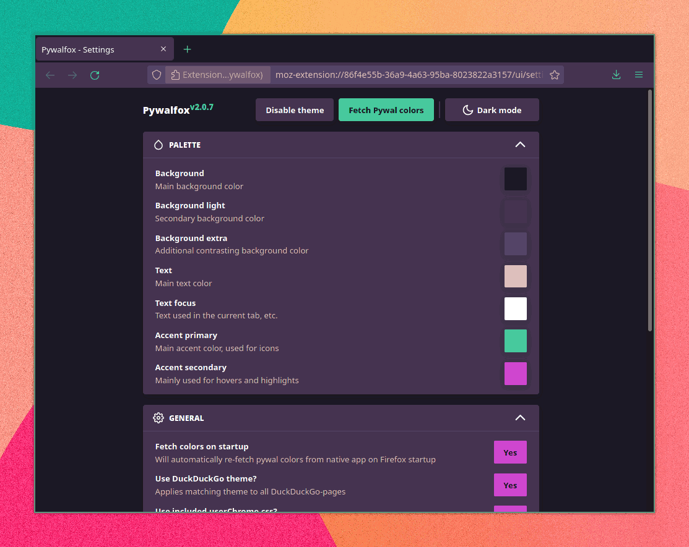

<h1 align="center" - click me!>
  <a name="logo"></a>
  <br>
  Pywalfox
</h1>
<h4 align="center">🎨 Dynamic theming of Firefox 🦊 (and Thunderbird 🐦) using your Pywal colors</h4>
<div align="center">
     <a href="https://addons.mozilla.org/en-US/firefox/addon/pywalfox"></a>
     <a href="https://addons.mozilla.org/en-US/firefox/addon/pywalfox"></a>
     <a href="https://addons.mozilla.org/en-US/firefox/addon/pywalfox"></a>
     <a href="https://addons.mozilla.org/en-US/firefox/addon/pywalfox"></a>
     <a href="https://aur.archlinux.org/packages/python-pywalfox"></a>
     <a href="https://www.mozilla.org/en-US/MPL/2.0/FAQ"></a>
</div>

<br>

- Tired of Firefox and Thunderbird not respecting your gorgeous Pywal colors like the rest of your system?
- Looking to rack up some karma :arrow_up: on [/r/unixporn](https://reddit.com/r/unixporn)?

Introducing **Pywalfox**, an add-on that themes [Firefox](https://addons.mozilla.org/firefox/addon/pywalfox/) and [Thunderbird](https://addons.thunderbird.net/thunderbird/addon/pywalfox/) with your [Pywal](https://github.com/dylanaraps/pywal) colors using the official [Theme API](https://developer.mozilla.org/docs/Mozilla/Add-ons/WebExtensions/manifest.json/theme) from Mozilla!

With Pywalfox you can:
- [x] Customize the colors of almost every UI element
- [x] Easily update the theme using the add-on GUI and/or the command line
- [x] Automatically theme DuckDuckGo :duck: searches in Firefox *(optional)*
- [x] Have bold text, styled dropdowns and much more *(optional)*
- [x] Automatically switch between a dark and a light theme based on the time of day



## ✅ Requirements
- Firefox and/or Thunderbird
- Python (version `2.7.X` or `3.X`)
- [Pywal](https://github.com/dylanaraps/pywal)

> **Note** <br>
> Pywalfox is supported on GNU/Linux, MacOS and Windows.

## 👨‍💻 Installation

1. Install the [Pywalfox native messaging application](https://github.com/Frewacom/pywalfox-native) using one of two methods below (depending on your operating system).
<details align=center>
<summary>
 <b>Arch Linux only (AUR) - click me!</b>
</summary>
<table align=center><tr><td>

Install from the <a href="https://aur.archlinux.org/packages/python-pywalfox/">Arch User Repository (AUR)<a>, e.g.

Paru: <br>
`paru -S python-pywalfox`

Yay: <br>
`yay -S python-pywalfox`

</td></tr></table>
</details>

<details align=center>
<summary>
<b>GNU/Linux, MacOS, Windows - click me!</b>
</summary>
<table align=center><tr><td>

Install from [PyPi](https://pypi.org/project/pywalfox/) with [`pip`](https://github.com/pypa/pip), i.e.

`pip install pywalfox`

</td></tr></table>

</details>

2. Run `pywalfox install` in your terminal.
3. Get the Pywalfox add-on for
   - [Firefox](https://addons.mozilla.org/firefox/addon/pywalfox/)
   - [Thunderbird](https://addons.thunderbird.net/thunderbird/addon/pywalfox/)
4. Restart Firefox and/or Thunderbird.
5. Generate Pywal colors with your preferred method, use e.g. [this guide](https://github.com/dylanaraps/pywal/wiki/Getting-Started).
6. Click the Pywalfox icon in the Firefox/Thunderbird UI and click "Fetch Pywal colors". This should apply a theme that uses your Pywal colors to the Firefox/Thunderbird GUI!

> **Note** <br>
> If you have problems: please review the Troubleshooting section below before opening a Github issue.

## 🤔 Usage

### 🗔 Update the theme through your terminal
Run `pywalfox update` in your terminal to trigger an update of the browser theme.
This command allows you to integrate Pywalfox into e.g. system theming scripts.
It is functionally equivalent to clicking "Fetch Pywal colors" in the add-on settings GUI (accessible from your toolbar).

### 🎨 Customization
The add-on settings GUI comes with extensive customization options divided into the following sections:

<details>
<summary>
<b>
💧 Palette (click for details)
</b>
</summary>

<br>
<table><tr><td>

The palette in the "Palette" section is used to temporarily customize one or more colors from the Pywal palette.
You can use one of the generated colors, or choose any color from a colorwheel.

> **Warning** <br>
> Changes to the palette will be reset when you click "Fetch Pywal colors" and when you run `pywalfox update`.

</td></tr></table>

</details>

<details>
<summary>
<b>
📝 Palette template (click for details)
</b>
</summary>

<br>
<table><tr><td>

If you want your palette customizations to be persistent (unlike the regular palette) you must save your current palette as a *palette template*:

1. Click "Fetch Pywal colors" in the add-on settings GUI or run `pywalfox update`
2. Customize the colors to your liking in the "Palette" section
   - ❗ *Colors from outside the Pywal palette (i.e. from the colorwheel) cannot be used in a template*.
3. Click "Load from current" in the "Palette template" section below.
   - ❗ *The colors can also be set directly in the "Palette template" section using Pywal color indices.*
4. Click "Save palette"

Your custom palette will now be applied whenever you update the browser theme.

</td></tr></table>

</details>

<details>
<summary>
<b>
🗂 ️Theme template (click for details)
</b>
</summary>

<br>
<table><tr><td>

The theme template assigns colors (from your palette template) to different browser elements.

To create a palette template, go through the items in the "Theme template" section and assign a color to each item.
The colors are identified by their names as seen in the "Palette template" section.

</td></tr></table>

</details>

> **Note** <br>
> Every browser element currently supported by the [Theme API](https://developer.mozilla.org/docs/Mozilla/Add-ons/WebExtensions/manifest.json/theme) can be customized.


### 🌗 Theme modes
There are three different theme modes: "Dark" (🌙), "Light" (☀) and "Auto" (👁)️. Selecting "Auto" will automatically switch between the other two modes based on a time interval found in the "General" section of the add-on settings GUI.

> **Note** <br>
> The dark and light modes have *separate* theme and palette templates. You will always modifiy the template for the currently selected mode.

### 🖺 Further theming with the included userChrome.css and userContent.css in Firefox
Some browser elements (e.g. the context menus) are not available through the [Theme API](https://developer.mozilla.org/docs/Mozilla/Add-ons/WebExtensions/manifest.json/theme). Pywalfox includes two custom CSS stylesheets (for Firefox) which apply your theme to some of these browser elements.

<table><tr><td>
Before you enable the custom CSS sheets in the add-on settings GUI you must navigate to <code>about:config</code> and set <code>toolkit.legacyUserProfileCustomizations.stylesheets</code> to <code>true</code>.
</td></tr></table>

## ❎ Uninstall
To uninstall Pywalfox from your system, run
```bash
pywalfox uninstall # Removes the manifest from native-messaging-hosts
```
and then
```bash
pip uninstall pywalfox # if you installed with pip
```
or
```bash
paru -R python-pywalfox # if you installed with paru (only Arch Linux)
```
depending on your chosen installation method.

## 🔧 Troubleshooting
This section lists some common problems and how to (hopefully) fix them.
This [troubleshooting guide from Mozilla](https://developer.mozilla.org/docs/Mozilla/Add-ons/WebExtensions/Native_messaging#Troubleshooting) may be of use if you encounter an error that is not listed here.

- Librewolf users must use an experimental version of `pywalfox-native` for now, see [#68](https://github.com/Frewacom/pywalfox/issues/68#issuecomment-873381669).

You should also
- check the log in the Debugging section at the bottom of the Pywalfox settings page for any errors;
- verify that `~/.cache/wal/colors` exists and contains the colors generated by Pywal;
- verify that `path` in `~/<native-messaging-hosts-folder>/pywalfox.json` is a valid path.

### 🚫 Common errors in the browser console
It is a good idea to check the Firefox browser console (`Tools > Web developer > Browser console`) for errors.
Common errors include:

<details><summary>
<b><code>ExtensionError: No such native application pywalfox</code></b>
</summary>

<br>
<table><tr><td>

   The manifest is not installed properly. Try installing the manifest manually by following the instructions [here](https://developer.mozilla.org/docs/Mozilla/Add-ons/WebExtensions/Native_manifests.).

   The manifest is located at `<path-to-python-site-packages>/pywalfox/assets/manifest.json`.

   After you have copied over the manifest to the correct path, make sure to also update the `path` property in the copied manifest. The `path` should point to `<path-to-python-site-packages>/pywalfox/bin/main.sh` (or `win.bat` if you are on Windows).

   If it still does not work, you can try to reinstall Firefox, see [#14](https://github.com/Frewacom/pywalfox/issues/14).

</td></tr></table>
</details>

<details><summary>
<b><code>stderr output from native app pywalfox: <installation-path>/main.sh: line 3: pywalfox: command not found</code></b>
</summary>

<br>
<table><tr><td>

  Pywalfox assumes that the `pywalfox` executable is in your `PATH`.

  If you can not run `pywalfox` from the command line (without specifying an absolute path), you must either add the path to the execuatable to your `PATH` variable, or move the executable to a path that already is in your `PATH`.

</td></tr></table>
</details>

> **Note** <br>
> The errors in the `Browser Console` are not limited to just Pywalfox!

## 🚧 Development setup
Do you want to hack on Pywalfox? Start here:
```bash
git clone git@github.com:Frewacom/pywalfox.git # or use your own fork
cd pywalfox
yarn install # or npm if you do not have yarn installed
yarn run debug
```

To build the extension into a zip:
```bash
yarn run build
```
